<div align="center">

# Hi there 👋, I'm Aarya Shirsath

### AI/ML • Backend • Full-Stack • Open Source

<p>
  
</p>

<p>
  <a href="https://portfolio-aarya07.vercel.app/">
    
  </a>
  <a href="https://github.com/Aarya0706">
    
  </a>
  <a href="https://www.linkedin.com/in/aarya-shirsath-9b7684340/">
    
  </a>
</p>


</div>

---

<div align="center">


</div>

---

# 🖥️ GITHUB ANALYTICS

<div align="center">



</div>

### 💻 Current Development Focus

`AI/ML` · `Backend` · `Full-Stack` · `DSA` · `Cloud` · `Open Source`

---

# 🔥 CONTRIBUTION STREAK

<div align="center">


</div>

---

# 👩‍💻 ABOUT ME

I'm a Computer Science & Engineering student interested in building **AI-powered applications, backend systems, and full-stack products**.

I enjoy taking ideas beyond prototypes and turning them into software that is:

**Useful → Explainable → Testable → Maintainable → Deployable**

### Areas I enjoy working in

- 🤖 **AI / ML** — LLM applications, RAG, multi-agent systems, explainable AI
- ⚙️ **Software Engineering** — backend development, REST APIs, full-stack applications, system design
- 🌍 **Open Source** — GitHub, pull requests, code review, collaborative development
- ☁️ **Cloud & Deployment** — AWS, Docker, Vercel, Render

---

# 🚀 FEATURED PROJECTS

## 🛡️ FraudShield AI

### Explainable Financial Fraud Detection Platform

A production-style fraud detection platform combining **XGBoost, FastAPI, SHAP explainability, risk classification, batch prediction, monitoring and API security**.

`Python` `XGBoost` `FastAPI` `Scikit-learn` `SHAP`

🔗 [Repository](https://github.com/Aarya0706/FraudShield-AI)  
🌐 [Live Demo](https://fraud-detection-api-eta.vercel.app/)  
📚 [API Docs](https://fraud-detection-api-w9hz.onrender.com/docs)

---

## 🏥 MediAgent AI

### Agentic AI Clinical Decision Support Platform

A healthcare-focused AI platform combining **multi-agent workflows, deterministic safety guardrails, patient-scoped RAG, observability and automated evaluation**.

`Python` `LangChain` `Groq` `Streamlit` `SQLite`

🔗 [Repository](https://github.com/Aarya0706/mediagent-ai)  
🌐 [Live Demo](https://mediagent-ai.streamlit.app/)

---

## 🛕 Temple Heritage

### AI-Powered Temple Discovery & Pilgrimage Platform

A full-stack platform combining **AI itinerary planning, AI assistance, temple discovery, reviews, moderation and gamified pilgrimage tracking**.

`Next.js` `React` `TypeScript` `Supabase` `Groq`

🔗 [Repository](https://github.com/Aarya0706/temple-heritage)  
🌐 [Live Demo](https://templeheritage.me/)

---

## 🩺 Healthcare Appointment Manager

### Full-Stack Healthcare Workflow Platform

A role-based healthcare platform supporting **patient, doctor and admin workflows**, appointments, LLM-generated summaries, medication reminders and calendar integration.

`Node.js` `Express` `PostgreSQL` `Prisma` `Gemini`

🔗 [Repository](https://github.com/Aarya0706/healthcare-appointment-manager)  
🌐 [Live Demo](https://healthcare-appointment-manager-sandy.vercel.app/)

---

## 📊 Nifty Research Assistant

### AI-Assisted Financial Research

An AI-powered application for financial and market research workflows.

`Python` `AI` `Research`

🔗 [Repository](https://github.com/Aarya0706/nifty-research-assistant)  
🌐 [Live Demo](https://nifty-research-assistant-nu.vercel.app/)

---

## 🎓 EduGrade-AI

### AI-Powered Assignment Evaluation Platform

An educational platform combining **OCR, AI-assisted grading, plagiarism detection and role-based workflows**.

`Python` `Flask` `SQLAlchemy` `Gemini`

🔗 [Repository](https://github.com/Aarya0706/EduGrade-AI)

---

# 🌍 OPEN SOURCE

Currently building hands-on open-source experience through community projects.

### Contribution Workflow

```text
Find an issue
      ↓
Understand the codebase
      ↓
Create a branch
      ↓
Implement the change
      ↓
Test locally
      ↓
Open a Pull Request
      ↓
Address review feedback
      ↓
Merge 🚀
```

### Current Focus

`OSCI` · `GitHub` · `AI Tools` · `Backend` · `Full-Stack`

---

# 🧠 TECH STACK

### Languages

`Python` `Java` `C++` `JavaScript` `TypeScript` `SQL`

### AI / Machine Learning

`LangChain` `RAG` `Multi-Agent Systems` `LLM Applications`

`XGBoost` `Scikit-learn` `Pandas` `NumPy` `SHAP`

`Prompt Engineering` `Model Evaluation`

### Backend

`FastAPI` `Flask` `Node.js` `Express` `Spring Boot`

`REST APIs` `Pydantic` `SQLAlchemy` `Prisma` `Uvicorn`

### Frontend

`React` `Next.js` `TypeScript` `HTML` `CSS` `Tailwind CSS`

### Databases

`PostgreSQL` `MySQL` `SQLite` `Supabase` `ChromaDB`

### Cloud & DevOps

`AWS` `Docker` `Vercel` `Render` `Git` `GitHub`

---

# 💼 EXPERIENCE

## AI/ML Intern — MPOnline

Worked across the machine-learning lifecycle including data preprocessing, model development and evaluation.

Built CNN-based classifiers for **CIFAR-10, LFW face recognition and MRI brain-tumor classification**.

---

## Software Development Engineer Intern — MPOnline

Built a full-stack task management system using **Flask and MySQL**, including authentication, REST APIs and task-management dashboards.

---

# 🏅 ACHIEVEMENTS

- 🥇 **TCS CodeVita Season 13** — Top 10% globally
- 💻 **HackerRank Certified Software Engineer**
- ☁️ **AWS Cloud Training**
- 🤖 **ServiceNow Virtual Internship**
- 📊 **NPTEL Marketing Analytics** — Elite
- 🔬 Co-authored a research paper on **Edge Computing**
- 🧩 Completed a **50-day DSA challenge in Java**

---

# 🎯 CURRENT FOCUS

```text
→ AI-powered applications
→ LLM / RAG systems
→ Multi-agent architectures
→ Backend engineering
→ System design
→ DSA
→ Cloud & deployment
→ Open-source contributions
```

---

# 📚 CURRENTLY LEARNING

`Advanced DSA` · `Backend Architecture` · `System Design`

`RAG Architecture` · `Multi-Agent Orchestration` · `AI Evaluation`

`Docker` · `Cloud Deployment` · `Open Source Collaboration`

---

# 💡 ENGINEERING PHILOSOPHY

> Build it. Understand it. Test it. Deploy it. Improve it.

```text
Idea
 ↓
Architecture
 ↓
Implementation
 ↓
Testing
 ↓
Deployment
 ↓
Iteration
```

---

# 🤝 CONNECT WITH ME

<div align="center">

<a href="https://github.com/Aarya0706">

</a>

<a href="https://www.linkedin.com/in/aarya-shirsath-9b7684340/">

</a>

<a href="https://portfolio-aarya07.vercel.app/">

</a>

<a href="mailto:arshir07@gmail.com">

</a>

</div>

---

<div align="center">

### ⚡ Building intelligent systems, one commit at a time.

</div>
